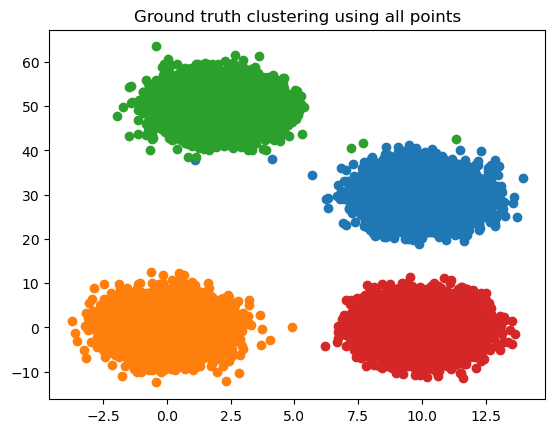

<div id="top"></div>
<!--
*** Thanks for checking out the Best-README-Template. If you have a suggestion
*** that would make this better, please fork the repo and create a pull request
*** or simply open an issue with the tag "enhancement".
*** Don't forget to give the project a star!
*** Thanks again! Now go create something AMAZING! :D
-->


<!-- PROJECT SHIELDS -->
<!--
*** I'm using markdown "reference style" links for readability.
*** Reference links are enclosed in brackets [ ] instead of parentheses ( ).
*** See the bottom of this document for the declaration of the reference variables
*** for contributors-url, forks-url, etc. This is an optional, concise syntax you may use.
*** https://www.markdownguide.org/basic-syntax/#reference-style-links
-->
[![Contributors][contributors-shield]][contributors-url]
[![Forks][forks-shield]][forks-url]
[![Stargazers][stars-shield]][stars-url]
[![Issues][issues-shield]][issues-url]
[![MIT License][license-shield]][license-url]
[![LinkedIn][linkedin-shield]][linkedin-url]

[](https://github.com/Shrecki/treeCoreset/actions/workflows/helloAction.yml)
[](https://img.shields.io/endpoint?url=https://gist.githubusercontent.com/Shrecki/fcde53f4e8d03ff100637910fc249bfc/raw/treeCoreset_line__main.json)
[](https://img.shields.io/endpoint?url=https://gist.githubusercontent.com/Shrecki/fcde53f4e8d03ff100637910fc249bfc/raw/treeCoreset_func__main.json)

<!-- PROJECT LOGO -->
<br />
<div align="center">
  <a href="https://github.com/Shrecki/treeCoreset">
    
  </a>

<h3 align="center">treeCoreset</h3>

  <p align="center">
    An implementation of the stream kmeans++ algorithm described in *modern C++ (Ackermann, Marcel R., et al. "Streamkm++ a clustering algorithm for data streams." Journal of Experimental Algorithmics (JEA) 17 (2012): 2-1.)*.
    The main program launches a server, to which points can be sent from other processes arbitrarily. Representatives and centroids can be queried from the server via simple commands.
    Communication relies on the ØMQ library for minimum overhead.
    The server estimates overall footprint on RAM for user input, and if not satisfiable exits and suggests modifications to input parameters to satisfy the specified RAM constraints. Note that the constraint does not consider virtual memory and as such is much stricter than what might be in effect available on your machine.
    <br />
    <a href="https://github.com/Shrecki/treeCoreset"><strong>Explore the docs »</strong></a>
    <br />
    <br />
    <a href="https://github.com/Shrecki/treeCoreset">View Demo</a>
    ·
    <a href="https://github.com/Shrecki/treeCoreset/issues">Report Bug</a>
    ·
    <a href="https://github.com/Shrecki/treeCoreset/issues">Request Feature</a>
  </p>
</div>


<!-- TABLE OF CONTENTS -->
<details>
  <summary>Table of Contents</summary>
  <ol>
    <li>
      <a href="#about-the-project">About The Project</a>
      <ul>
        <li><a href="#built-with">Built With</a></li>
      </ul>
    </li>
    <li>
      <a href="#getting-started">Getting Started</a>
      <ul>
        <li><a href="#prerequisites">Prerequisites</a></li>
        <li><a href="#installation">Installation</a></li>
      </ul>
    </li>
    <li><a href="#usage">Usage</a></li>
    <li><a href="#roadmap">Roadmap</a></li>
    <li><a href="#contributing">Contributing</a></li>
    <li><a href="#license">License</a></li>
    <li><a href="#contact">Contact</a></li>
    <li><a href="#acknowledgments">Acknowledgments</a></li>
  </ol>
</details>


<!-- ABOUT THE PROJECT -->
## About The Project

[![Product Name Screen Shot][product-screenshot]](https://example.com)

<p align="right">(<a href="#top">back to top</a>)</p>


### Built With


* [Eigen](https://eigen.tuxfamily.org/index.php?title=Main_Page)
* [Boost](https://www.boost.org/)
* [ØMQ](https://zeromq.org/)
* [cmake 3.20 or higher](https://cmake.org/)
* [Pybind11](https://github.com/pybind/pybind11)

<p align="right">(<a href="#top">back to top</a>)</p>


<!-- GETTING STARTED -->
## Getting Started

This is an example of how you may give instructions on setting up your project locally.
To get a local copy up and running follow these simple example steps.

### Prerequisites

Eigen, Boost and ØMQ are required for this project to work. Eigen, Pybind and cmake are already included as submodules. Pybind and cmake still need to be built before the project can be built as well.
Python 3.10 is required for this project's compilation as well.
If you are using a Python environment, make sure to activate an environment with Python 3.10 when compiling.


### Installation

There are three main ways the project can be built. Using pip (the recommended way), Docker, or from source.

#### Using Pip

Simply run:
``` 
pip install treeCoreset
```

Make sure you have Python 3.10 installed and active (if using venv, mamba, anaconda for instance) when calling pip like so.

#### Using the Docker image


#### Building from source

0. Install prerequisite libraries:
   ```sh
   sudo apt-get install -y build-essential g++ python-dev autotools-dev libicu-dev libbz2-dev lcov libcppunit-dev software-properties-common
   ```
1. Clone the repo
   ```sh
   git clone https://github.com/Shrecki/treeCoreset.git
   ```
2. Install the submodules:
  ```sh
  git submodule init
  git submodule update
  ```
3. If your cmake version is outdated, install a newer version, e.g:
  ```sh
  wget https://github.com/Kitware/CMake/releases/download/v3.22.5/cmake-3.22.5.tar.gz
  tar -zxvf cmake-3.22.5.tar.gz
  cd cmake-3.22.5
  sudo ./bootstrap
  sudo make
  sudo make install
  cmake --version
  ```

4. Install ØMQ, either from source file or through apt:
  ```sh
  sudo apt-get install -y libzmq3-dev
  ```

5. Install Boost:
  ```sh
  sudo apt-get install -y libboost-all-dev
  wget -O boost_1_79_0.tar.gz https://boostorg.jfrog.io/artifactory/main/release/1.79.0/source/boost_1_79_0.tar.gz
  tar xzvf boost_1_79_0.tar.gz
  cd boost_1_79_0/
  ./bootstrap.sh --prefix=/usr/
  ./b2
  sudo ./b2 install
  ```
6. Install Pybind11:
  ```sh
  cd pybind11
  mkdir build && cd build
  cmake .. && make && sudo make install
  ```
6. Finally, make the project:
   ```sh
   mkdir cmake-build-debug-coverage
   cd cmake-build-debug-coverage
   cmake ../ -DCODE_COVERAGE=ON
   cmake --build . --target unit_test --config Release -- -j
   ```

Note that in CMakeList, march=native is used. If you're on an unsupported platform, you can remove this flag or - better yet - replace it with the flag corresponding to your CPU architecture to benefit from Eigen's maximum performance.

<p align="right">(<a href="#top">back to top</a>)</p>


<!-- USAGE EXAMPLES -->
## Usage

### Direct usage method

There are two main ways to use this program. The first is to directly initialize the coreset object and send it points. This is the recommended way, as it is faster. There are three main steps:
- Initialize the coreset object, by specifying a number of buckets and of representatives. The number of buckets is given as ceil(log2(n/n_representatives)), where n is the number of points you expect to pass in total to the algorithm (ie: number of samples in your original dataset). The number of representatives should be at least 200*k, k the number of centroids to find later, for decent performance.
- Send the points to the coreset object
- Recover the representatives

Doing these three steps can be done as follows:
```Python
import treeCoreset

k=3 # For the sake of the example, we let k, the number of clusters, be 3
n_reps = 200*k
n_buckets = int(np.ceil(np.log2(n/ n_reps)))


# Initialize the coreset object
cluster_rep = treeCoreset.ClusteredPoints(n_buckets, n_reps)
```

Assuming your data is a numpy array, you can pass it directly with only a single function call to the cluster object. You should also specify how many "points" have been passed, so that the function can figure out which axis is features and which axis is samples:

```python
cluster_rep.insertVectors(X.astype(np.double, order='C').T, X.shape[0])
```

Lastly, representatives can be recovered as simply as:

```python
reps = cluster_rep.getRepresentatives()
```

### A complete Python example

To make clear the purpose of this library, let's walk through a minimal example.
Assume the following code and data:
```Python
import numpy as np
import matplotlib.pyplot as plt
import treeCoreset

n_per_cluster = 10000
X1 = np.random.multivariate_normal([0, 0],[[1, 0], [0, 10]], n_per_cluster)
X2 = np.random.multivariate_normal([10, 0],[[1, 0], [0, 10]], n_per_cluster)
X3 = np.random.multivariate_normal([2, 50],[[1, 0], [0, 10]], n_per_cluster)
X4 = np.random.multivariate_normal([10, 30],[[1, 0], [0, 10]], n_per_cluster)


plt.scatter(X1[:,0], X1[:,1], label='X1')
plt.scatter(X2[:,0], X2[:,1], label='X2')
plt.scatter(X3[:,0], X3[:,1], label= 'X3')
plt.scatter(X4[:,0], X4[:,1], label= 'X4')

plt.legend()

X = np.concatenate((X1, X2, X3, X4))
```


We've created in particular four clusters here, in effect. We will therefore perform clustering with k=4. Let's now extract representatives:

```python
k = 4
n_reps = 200*k
n_buckets = int(np.ceil(np.log2(n_per_cluster*3 / n_reps)))

# Initialize and insert all points in the clusterer
cluster_rep = treeCoreset.ClusteredPoints(n_buckets, n_reps)
cluster_rep.insertVectors(X.astype(np.double, order='C'), X.shape[0])

# Recover the representatives
reps = cluster_rep.getRepresentatives()

# Let's visualize the representatives
plt.scatter(X1[:,0], X1[:,1])
plt.scatter(X2[:,0], X2[:,1])
plt.scatter(X3[:,0], X3[:,1])
plt.scatter(X4[:,0], X4[:,1])

plt.scatter(reps[:,0], reps[:, 1], label='Extracted representatives')
plt.legend()
```


Now, we will apply KMeans and compare the results when computing the centroids on the entire dataset and on the representatives only:
```python
def perform_clustering_and_plot(data,reps, use_reps, title, k):
    kmeans = KMeans(n_clusters=k)
    if use_reps:
        kmeans.fit(reps)
        assignments = kmeans.predict(data)
    else:
        kmeans.fit(data)
        assignments = kmeans.labels_
    clusters = [data[assignements == k,:] for k in np.unique(assignments)]

    for c in clusters:
        plt.scatter(c[:,0], c[:, 1])

    plt.title(title)
    return assignments

_ = perform_clustering_and_plot(X, reps, False, 'Ground truth clustering using all points', 4)
_ = perform_clustering_and_plot(X, reps, True, 'Clustering using {} representatives ({} % of points)'.format(n_reps, 100*n_reps/(n_per_cluster*4)), 4)
```



One can see that the extracted clusters were indeed well matched. We can finally state the advantage of this method: we are applying kmeans to the representatives only, which reduces the number of points to consider.
Notice that the number of representatives is **independent** of the number of samples in the original data! It is conditioned by the number of centroids to choose.

### Remote server method

A MATLAB binding is also available to pass data between the coreset object and MATLAB. In such a case, the MATLAB program acts as a client and the coreset object as a server.

The server expecting the stream can be started by running the main program:
   ```sh
   ./treeCoreset
   ```

For the complete set of instructions, type
   ```sh
   ./treeCoreset --help
   ```

Once the server is launched, any other process can send points to the server, as if part of a stream, request representatives, centroids or even stop the server.
For convenience, functions in MATLAB are already provided for the client-side.


Should you wish to implement a communication in an unsupported language, here are relevant details to consider. For any transmission to happen between client and server, the client must fulfill the following conditions:
1. Be the only client connected to the server (any new connection will be refused by the server while a client is still attached to the socket).
2. Connect to the ipc socket specified by the user, using ØMQ's API. By default, this socket is ipc:///tmp/sock-0. This connection can only be of type ZMQ_PAIR.
3. Send an appropriate request to the server


<p align="right">(<a href="#top">back to top</a>)</p>


<!-- CONTRIBUTING -->
## Contributing

Contributions are what make the open source community such an amazing place to learn, inspire, and create. Any contributions you make are **greatly appreciated**.

If you have a suggestion that would make this better, please fork the repo and create a pull request. You can also simply open an issue with the tag "enhancement".
Don't forget to give the project a star! Thanks again!

1. Fork the Project
2. Create your Feature Branch (`git checkout -b feature/AmazingFeature`)
3. Commit your Changes (`git commit -m 'Add some AmazingFeature'`)
4. Push to the Branch (`git push origin feature/AmazingFeature`)
5. Open a Pull Request

<p align="right">(<a href="#top">back to top</a>)</p>


<!-- LICENSE -->
## License

Distributed under the GNU License. See `LICENSE.txt` for more information.

<p align="right">(<a href="#top">back to top</a>)</p>


<!-- CONTACT -->
## Contact

Fabrice Guibert - [@twitter_handle](https://twitter.com/twitter_handle) - fabrice.guibert@epfl.ch

Project Link: [https://github.com/Shrecki/treeCoreset](https://github.com/Shrecki/treeCoreset)

<p align="right">(<a href="#top">back to top</a>)</p>


<!-- ACKNOWLEDGMENTS -->
## Acknowledgments

* [Ackermann, Marcel R., et al. "Streamkm++ a clustering algorithm for data streams." Journal of Experimental Algorithmics (JEA) 17 (2012): 2-1.](https://dl.acm.org/doi/abs/10.1145/2133803.2184450), original algorithm of stream kmeans++ of which this codebase is an implementation.
* []()
* []()

<p align="right">(<a href="#top">back to top</a>)</p>


<!-- MARKDOWN LINKS & IMAGES -->
<!-- https://www.markdownguide.org/basic-syntax/#reference-style-links -->
[contributors-shield]: https://img.shields.io/github/contributors/Shrecki/treeCoreset.svg?style=for-the-badge
[contributors-url]: https://github.com/Shrecki/treeCoreset/graphs/contributors
[forks-shield]: https://img.shields.io/github/forks/Shrecki/treeCoreset.svg?style=for-the-badge
[forks-url]: https://github.com/Shrecki/treeCoreset/network/members
[stars-shield]: https://img.shields.io/github/stars/Shrecki/treeCoreset.svg?style=for-the-badge
[stars-url]: https://github.com/Shrecki/treeCoreset/stargazers
[issues-shield]: https://img.shields.io/github/issues/Shrecki/treeCoreset.svg?style=for-the-badge
[issues-url]: https://github.com/Shrecki/treeCoreset/issues
[license-shield]: https://img.shields.io/github/license/Shrecki/treeCoreset.svg?style=for-the-badge
[license-url]: https://github.com/Shrecki/treeCoreset/blob/master/LICENSE.txt
[linkedin-shield]: https://img.shields.io/badge/-LinkedIn-black.svg?style=for-the-badge&logo=linkedin&colorB=555
[linkedin-url]: https://linkedin.com/in/linkedin_username
[product-screenshot]: images/screenshot.png
